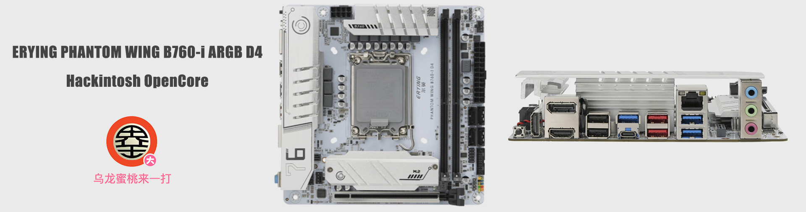

## 尔英 PHANTOM WING B760-I ARGB D4 黑苹果 OpenCore EFI



[OpenCore 1.0.0](https://github.com/acidanthera/OpenCorePkg)

### macOS

- macOS Monterey 12.x
- macOS Ventura  13.x 
- macOS Sonoma 14.x

### 硬件

- 芯片组: B760
- 处理器: 英特尔12代 i5-12400F
- 内   存: 金百达16G（8G*2套条）DDR4 3600MHz
- 硬   盘: 致钛PC005 Active 512GB MacOS
- 独   显: 蓝宝石 AMD Radeon RX 5600 XT DDR6 6GB
- 声   卡: 瑞昱 ALC897
- 有线网卡: 瑞昱 RTL8125
- 无线网卡: 英特尔 AX210

### BIOS设置

```
Advanced
  |-- Super IO Configuraion
     |-- Serial Port 1 Configuration : Disabled
  
  |-- PowerManagement Configuration
     |-- Wake on LAN : Disabled
  
  |-- CSM Configuration
	      |-- Video：UEFI  ( need reboot )
	      |-- CSM Auto Switch : Disabled 
	      |-- CSM Support : Disabled
 
Chipset
  |-- Primary Display : Auto
  |-- VT-d : Disabled

Boot
  |-- Fast Boot : Disabled

Security
  |-- Secure Boot Mode  : Disabled

```

### 注意事项

 - 安装成功后必须使用 [OCAuxiliaryTools](https://github.com/ic005k/OCAuxiliaryTools) 生成你自己的 SMBIOS
 - 此EFI中的英特尔无线网卡驱动[AirportItlwm.kext](https://github.com/OpenIntelWireless/itlwm/releases)仅适用于 MacOS 14.4.1 Sonoma,安装其它版本请自行下载替换此驱动
 - 如需使用带有小核心的CPU，必须勾选配置文件中Kernel--ProvideCurrentCpuinfo选项


### 联系我们

QQ群: 23304408


### 常用工具

- [Hackintool](https://github.com/headkaze/Hackintool) 
- [OCAuxiliaryTools](https://github.com/ic005k/OCAuxiliaryTools) AKA `OCAT`.
- [OpenCore Configurator](https://mackie100projects.altervista.org/opencore-configurator/) AKA `OCC`.
- [gibMacOS](https://github.com/corpnewt/gibMacOS) Build your own MacOS image.
- [ProperTree](https://github.com/corpnewt/ProperTree) Plist editor.